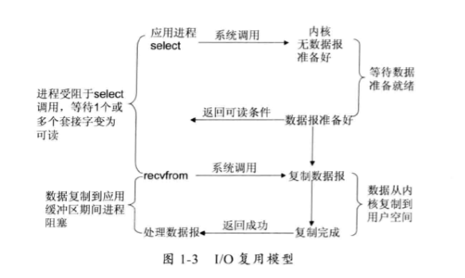
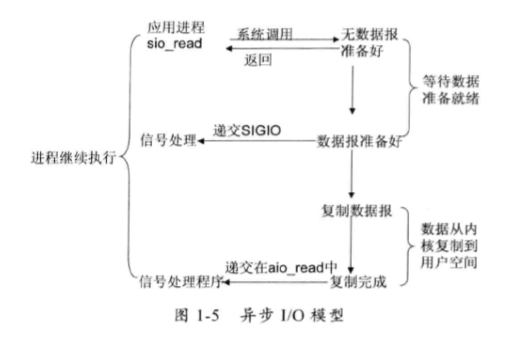

#### liunx 网络I/O模型

- 阻塞I/O模型：一个线程处理一个IO，进程阻塞

- 非阻塞I/O模型：缓冲区无数据，返回一个EWOULDBLOCK错误，一般进行轮询检查此状态

- I/O复用模型：Liunx提供select/poll,进程通过将文件描述符(fd)传递给select/poll系统调用,阻塞在select操作上，这样select/poll可以侦测多个fd是否处于就绪状态；但是fd数量有限，受到一些制约，因此liunx还提供了一个epoll的系统调用，epool使用基于驱动方式代替顺序扫码，提高性能，当有fd就绪时，立即回调函数rollback

- 信号驱动I/O模型：提高开启套接字信号驱动IO功能，并通过系统调用sigaction执行信号处理函数，当数据准备就绪时，就为改进程生成SIGIO信号，通过信号回调通知应用程序调用recvform函数读取数据，并通知主循环函数处理数据

  

- 异步I/O模型：告知内核启动某个操作，并让内核在整个操作完成后通知我们。

